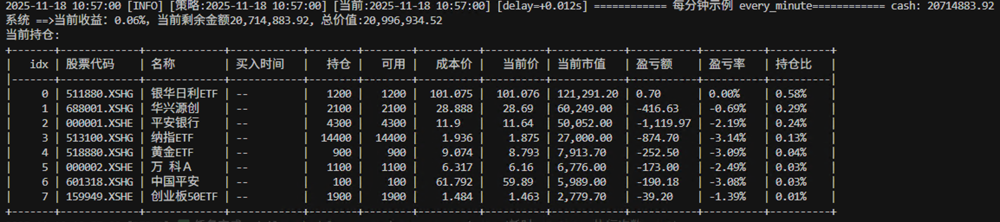

# API 文档

本页罗列策略可直接使用的核心 API、模型与工具函数，默认与聚宽命名保持一致。完整导出可通过 `from jqdata import *` 或 `from bullet_trade.compat.api import *` 获得。

## 策略入口与全局对象
- `g`：全局状态容器，可挂载自定义属性。
- `log`：日志对象，支持 `debug/info/warn/error`。
- 消息：`send_msg`、`set_message_handler`（用于站内消息或通知）。

## 调度与风控
- `run_daily(func, time=...)`、`run_weekly`、`run_monthly`、`unschedule_all`：同聚宽语义，支持 `open-30m`、`close+30s`、`every_minute` 等时间表达式。
- `set_benchmark`：设置基准指数，如 `set_benchmark('000300.XSHG')`。
- `set_option`：行为开关，推荐 `set_option('use_real_price', True)` 以真实盘口成交。
- `set_slippage`、`set_order_cost`：滑点与手续费设置。
- `set_data_provider(name, instance=None)` / `get_data_provider()`：切换或获取当前数据源。

## 数据接口
- `get_price`：历史行情，支持日/分钟频率、复权选项、批量标的。
- `attribute_history`、`get_current_data`：历史特征与当前行情快照。
- `get_trade_days`、`get_all_securities`、`get_index_stocks`、`get_split_dividend`：交易日、标的列表与分红送股信息。
- Tick/订阅（最小实现）：`subscribe`、`unsubscribe`、`unsubscribe_all`、`get_current_tick`。

## 订单与组合模型
- 下单：`order`、`order_value`、`order_target`、`order_target_value`；价格样式 `MarketOrderStyle`、`LimitOrderStyle`。
- 成本与滑点：`FixedSlippage`、`OrderCost`。
- 数据模型：`Order`、`Trade`、`OrderStatus`、`OrderStyle`、`Position`、`Portfolio`、`SubPortfolio`、`SecurityUnitData`。

## 工具函数
- `print_portfolio_info(portfolio)`：打印账户/持仓概览。

- `prettytable_print_df(df)`：以表格形式输出 DataFrame，便于日志查阅。
- 常用模块别名：`datetime/math/random/time/np/pd` 已自动导出，聚宽策略可直接调用。

## CLI 衔接
- `bullet-trade --help`：查看回测、实盘、server、report 子命令。
- 回测：`bullet-trade backtest ...`；实盘：`bullet-trade live ...`；远程服务：`bullet-trade server ...`；报告：`bullet-trade report ...`。

更多细节或新增 API 需求，欢迎在 [邀请贡献](contributing.md) 中提到的渠道提出。
