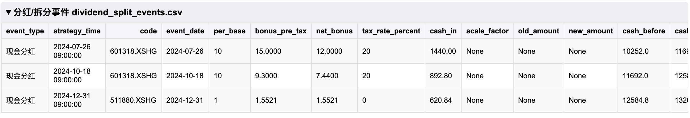
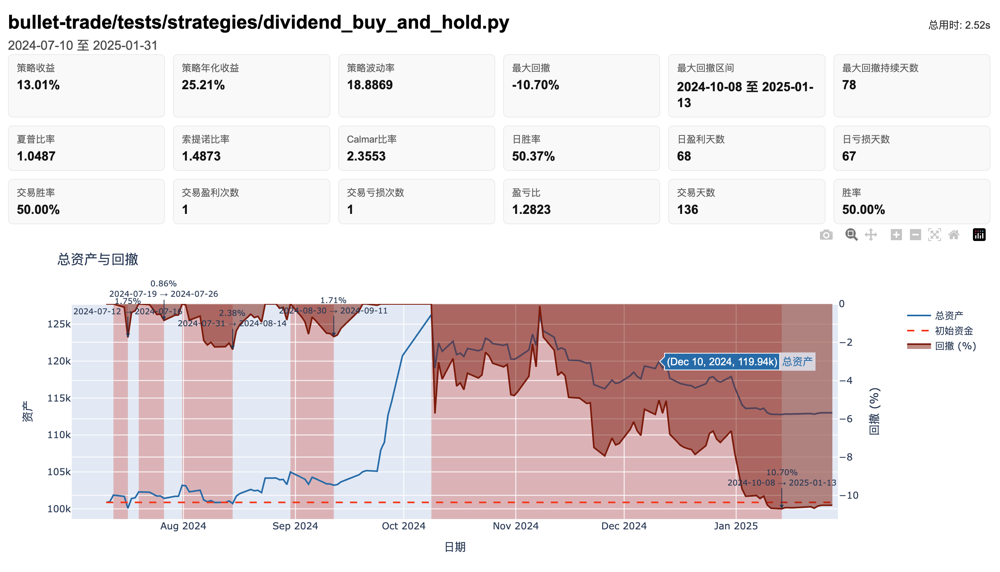

# 回测引擎

如何在本地快速跑通与聚宽对齐的回测，落盘报告并校验指标。

## 最短路径（3 步）

1) 安装与模板：
```bash
python -m venv .venv && source .venv/bin/activate
pip install -e "bullet-trade[dev]"
cp env.backtest.example .env
```

2) 只填本页用到的变量（其余见 [配置总览](config.md)）：
```bash
# 数据源类型 (jqdata, tushare, qmt)
DEFAULT_DATA_PROVIDER=jqdata         # 必填，行情源
JQDATA_USERNAME=your_username       # 选填，按数据源需要
JQDATA_PASSWORD=your_password
```

3) 运行回测：
```bash
bullet-trade backtest strategies/demo_strategy.py \
  --start 2024-01-01 --end 2024-06-30 \
  --benchmark 000300.XSHG \
  --cash 100000 \
  --output backtest_results/demo
```

> 聚宽策略可直接复用：`from jqdata import *`、`order_target_value` 等 API 已兼容，无需改代码。

## 回测引擎工作流程

```
┌─────────────────────────────────────────────────────────────────────────┐
│                           回测引擎启动                                    │
├─────────────────────────────────────────────────────────────────────────┤
│  1. 加载策略文件                                                         │
│     ├─ 解析 initialize / handle_data / before_trading_start 等函数      │
│     └─ 注入 jqdata 兼容 API（get_price、order 等）                       │
├─────────────────────────────────────────────────────────────────────────┤
│  2. 初始化回测环境                                                       │
│     ├─ 创建 Context（账户、持仓、时间）                                   │
│     ├─ 初始化 Portfolio（初始资金、持仓）                                 │
│     └─ 调用策略 initialize(context)                                      │
├─────────────────────────────────────────────────────────────────────────┤
│  3. 逐交易日循环                                                         │
│     ┌─────────────────────────────────────────────────────────────────┐ │
│     │  每个交易日：                                                    │ │
│     │  ├─ before_trading_start(context)  # 盘前回调                   │ │
│     │  ├─ 执行 run_daily 注册的定时任务                                │ │
│     │  ├─ handle_data(context, data)     # 盘中回调（如有）            │ │
│     │  ├─ 处理订单：撮合成交、计算滑点、扣除费用                        │ │
│     │  ├─ 处理分红送股（use_real_price=True 时）                       │ │
│     │  ├─ 更新持仓市值、账户净值                                       │ │
│     │  └─ after_trading_end(context)     # 盘后回调                    │ │
│     └─────────────────────────────────────────────────────────────────┘ │
├─────────────────────────────────────────────────────────────────────────┤
│  4. 回测结束                                                             │
│     ├─ 计算风险指标（年化收益、最大回撤、夏普比率等）                     │
│     ├─ 生成交易记录、每日净值、持仓快照                                  │
│     └─ 输出报告（HTML/CSV/PNG）                                         │
└─────────────────────────────────────────────────────────────────────────┘
```

## 推荐设置：真实价格 + 分红送股

在策略初始化中开启真实价格撮合，更贴近实盘：

```python
set_option('use_real_price', True)
```

选择真实价格成交后，系统会自动处理分红、配股等现金/股份变动。



## 兼容聚宽的策略示例

```python
from jqdata import *

def initialize(context):
    set_benchmark('000300.XSHG')
    set_option('use_real_price', True)
    g.target = ['000001.XSHE', '600000.XSHG']
    run_daily(market_open, time='10:00')

def market_open(context):
    for stock in g.target:
        df = get_price(stock, count=5, fields=['close'])
        if df['close'][-1] > df['close'].mean():
            order_target_value(stock, 10000)
```

## 命令行参数

```bash
bullet-trade backtest <strategy_file> [OPTIONS]
```

### 必填参数

| 参数 | 说明 | 示例 |
|------|------|------|
| `strategy_file` | 策略文件路径 | `strategies/demo.py` |
| `--start` | 回测开始日期 | `--start 2024-01-01` |
| `--end` | 回测结束日期 | `--end 2024-06-30` |

### 可选参数

| 参数 | 默认值 | 说明 |
|------|--------|------|
| `--cash` | `100000` | 初始资金 |
| `--frequency` | `day` | 回测频率：`day`（日线）或 `minute`（分钟线） |
| `--benchmark` | 无 | 基准指数代码，如 `000300.XSHG` |
| `--output` | `./backtest_results` | 输出目录 |
| `--log` | 自动生成 | 日志文件路径 |

### 输出控制

| 参数 | 默认 | 说明 |
|------|------|------|
| `--images` | 关闭 | 生成 PNG 图表（净值曲线、持仓分布等） |
| `--no-csv` | 导出 | 禁用 CSV 明细导出 |
| `--no-html` | 生成 | 禁用 HTML 交互报告 |
| `--no-logs` | 写入 | 仅终端打印，不写日志文件 |

### 自动报告

| 参数 | 默认值 | 说明 |
|------|--------|------|
| `--auto-report` | 关闭 | 回测完成后自动生成标准化报告 |
| `--report-format` | `html` | 报告格式：`html` 或 `pdf` |
| `--report-template` | 无 | 自定义报告模板路径 |
| `--report-title` | 目录名 | 报告标题 |
| `--report-metrics` | 全部 | 展示的指标（逗号分隔） |

## 输出结果说明

回测完成后，输出目录包含以下文件：

```
backtest_results/
├── backtest.log           # 回测日志（含策略 log.info 输出）
├── report.html            # 交互式 HTML 报告
├── metrics.json           # 风险指标 JSON
├── daily_records.csv      # 每日净值记录
├── daily_positions.csv    # 每日持仓快照
├── trades.csv             # 交易明细
├── annual_returns.csv     # 年度收益
├── monthly_returns.csv    # 月度收益
├── risk_metrics.csv       # 风险指标表
├── instrument_pnl.csv     # 分标的盈亏
├── open_counts.csv        # 开仓次数统计
└── dividend_split_events.csv  # 分红送股事件
```

### 核心文件说明

#### `daily_records.csv` - 每日净值

| 列名 | 说明 |
|------|------|
| `date` | 交易日期 |
| `total_value` | 账户总资产 |
| `cash` | 现金余额 |
| `positions_value` | 持仓市值 |
| `daily_return` | 当日收益率 |
| `cumulative_return` | 累计收益率 |

#### `trades.csv` - 交易明细

| 列名 | 说明 |
|------|------|
| `datetime` | 成交时间 |
| `security` | 证券代码 |
| `action` | 买入/卖出 |
| `amount` | 成交数量 |
| `price` | 成交价格 |
| `commission` | 手续费 |
| `pnl` | 本次盈亏 |

#### `metrics.json` - 风险指标

```json
{
  "策略收益": "25.32%",
  "策略年化收益": "18.56%",
  "最大回撤": "-12.34%",
  "夏普比率": "1.65",
  "Calmar比率": "1.50",
  "胜率": "62.50%",
  "盈亏比": "1.85",
  "交易天数": 120
}
```

## 回测结果与报告

- 结果目录包含日志、CSV、HTML 报告；如需单独生成报告可执行：
  ```bash
  bullet-trade report --input backtest_results/demo --format html
  ```
- 报告文件（HTML/PNG）可直接复用到站点或 MR 截图。



## 常见问题

### 中文字体问题
首次生成图片会自动配置中文字体，确保系统存在任意中文字体即可。

### 数据认证失败
检查 `.env` 中的账号/Token 或环境变量覆盖，参考 [配置总览](config.md)。

### 分钟线回测
确认数据源支持分钟线，且策略设置 `use_real_price=True`。

### 日志为空
若未指定 `--log` 且又使用了 `--no-logs`，不会写入文件。

### 回测速度慢
- 减少回测时间范围
- 使用 `--no-images` 跳过图表生成
- 检查策略中是否有不必要的数据查询

### 与聚宽结果不一致
- 确认使用相同的数据源（JQData）
- 检查 `use_real_price` 设置是否一致
- 确认手续费、滑点设置相同
