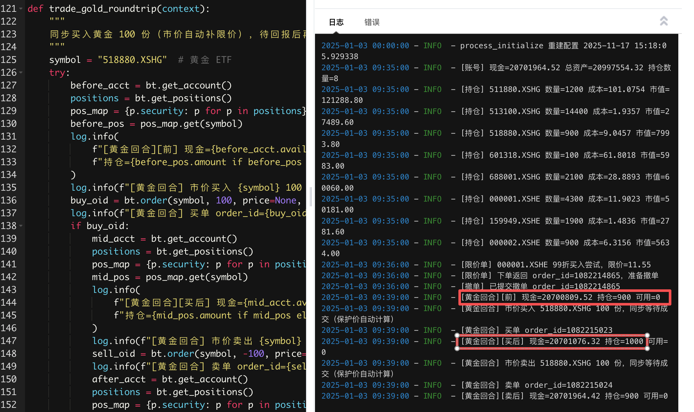

# 交易支撑

此页对应 bullettrade.cn 首页“交易服务”入口，重点介绍聚宽模拟盘如何通过远程 QMT 服务完成真实下单，以及相关调试方法。

## 聚宽模拟盘接入（Remote QMT）

1) 启动或接入远程 QMT server：参考 [QMT 服务配置](qmt-server.md) 启动数据+交易服务，记下 `host/port/token` 与账户标识。  
2) 将辅助文件复制到聚宽研究根目录：  
   - `bullet-trade/helpers/bullet_trade_jq_remote_helper.py`  
   - `bullet-trade/helpers/jq_remote_strategy_example.py`（示例策略，可参照调整）  
3) 在聚宽策略里配置并下单：
   ```python
    from jqdata import *  # 聚宽内置
    import bullet_trade_jq_remote_helper as bt
    # ===== 配置区域 =====
    BT_REMOTE_HOST = 'xxx.xxx.xxx.xxx'  #远程qmt服务器
    BT_REMOTE_PORT = 58620              #远程qmt服务器端口
    BT_REMOTE_TOKEN = 'secret_must_strong_6723816'  #修改为你自己的服务器token秘钥
    ACCOUNT_KEY = None  # 可选
    SUB_ACCOUNT = None  # 可选

    def _ensure_configured():
        if not BT_REMOTE_TOKEN:
            raise RuntimeError("请先在 BT_REMOTE_HOST/BT_REMOTE_PORT/BT_REMOTE_TOKEN/ACCOUNT_KEY/SUB_ACCOUNT 填写远程服务器配置")
        bt.configure(
            host=BT_REMOTE_HOST,
            port=BT_REMOTE_PORT,
            token=BT_REMOTE_TOKEN,
            account_key=ACCOUNT_KEY,
            sub_account_id=SUB_ACCOUNT,
        )
        # 让券商端可用数据补价
        bt.get_broker_client().bind_data_client(bt.get_data_client())


    def process_initialize(context):
        """
        聚宽重启/代码刷新时调用，此处完成所有初始化与任务注册。
        """
        log.info(f"process_initialize 重建配置 {datetime.datetime.now()}")
        _ensure_configured()


   def initialize(context):
        set_benchmark("000001.XSHE")
        set_option("use_real_price", True)

        run_daily(show_account_and_positions, time="09:35")
        run_daily(place_limit_buy_and_cancel, time="09:36")
        #run_daily(place_market_buy_async, time="09:37")
        #run_daily(check_open_orders, time="09:38")
        run_daily(trade_gold_roundtrip, time="09:39")

   def show_account_and_positions(context):
        """
        打印账户与持仓。
        """
        try:
            acct = bt.get_account()
            positions = bt.get_positions()
            log.info(
                f"[账号] 现金={acct.available_cash:.2f} 总资产={acct.total_value:.2f} 持仓数量={len(positions)}"
            )
            for pos in positions:
                log.info(f"[持仓] {pos.security} 数量={pos.amount} 成本={pos.avg_cost:.4f} 市值={pos.market_value:.2f}")
        except Exception as exc:
            log.error(f"获取账户/持仓失败: {exc}")

    def place_limit_buy_and_cancel(context):
        """
        取当前价打 99 折挂单买入 100 手，wait_timeout=10s 同步等待，然后尝试撤单。
        """
        symbol = "000001.XSHE"
        try:
            last = bt.get_data_client().get_last_price(symbol)
            if not last:
                log.warning(f"[限价单] 无法获取 {symbol} 价格，跳过")
                return
            limit_price = round(last * 0.99, 2)
            log.info(f"[限价单] {symbol} 99折买入尝试，限价={limit_price}")
            oid = bt.order(symbol, 100, price=limit_price, wait_timeout=10)
            log.info(f"[限价单] 下单返回 order_id={oid}，准备撤单")
            if oid:
                try:
                    bt.cancel_order(oid)
                    log.info(f"[撤单] 已提交撤单 order_id={oid}")
                except Exception as exc:
                    log.error(f"[撤单] 撤单失败 order_id={oid}, err={exc}")
        except Exception as exc:
            log.error(f"[限价单] 下单流程异常: {exc}")


    def place_market_buy_async(context):
        """
        市价单（自动补价转限价），不等待回报。
        """
        symbol = "000002.XSHE"
        try:
            log.info(f"[市价单] {symbol} 买入 100，异步模式")
            oid = bt.order(symbol, 100, price=None, wait_timeout=0)
            log.info(f"[市价单] 已提交，order_id={oid}")
        except Exception as exc:
            log.error(f"[市价单] 下单失败: {exc}")


    def trade_gold_roundtrip(context):
        """
        同步买入黄金 100 份（市价自动补限价），待回报后再卖出同等数量。
        """
        symbol = "518880.XSHG"  # 黄金 ETF
        try:
            before_acct = bt.get_account()
            positions = bt.get_positions()
            pos_map = {p.security: p for p in positions}
            before_pos = pos_map.get(symbol)
            log.info(
                f"[黄金回合][前] 现金={before_acct.available_cash:.2f} "
                f"持仓={before_pos.amount if before_pos else 0} 可用={before_pos.available if before_pos else 0}"
            )
            log.info(f"[黄金回合] 市价买入 {symbol} 100 份，同步等待成交（保护价自动计算）")
            buy_oid = bt.order(symbol, 100, price=None, wait_timeout=10)
            log.info(f"[黄金回合] 买单 order_id={buy_oid}")
            if buy_oid:
                mid_acct = bt.get_account()
                positions = bt.get_positions()
                pos_map = {p.security: p for p in positions}
                mid_pos = pos_map.get(symbol)
                log.info(
                    f"[黄金回合][买后] 现金={mid_acct.available_cash:.2f} "
                    f"持仓={mid_pos.amount if mid_pos else 0} 可用={mid_pos.available if mid_pos else 0}"
                )
                log.info(f"[黄金回合] 市价卖出 {symbol} 100 份，同步等待成交（保护价自动计算）")
                sell_oid = bt.order(symbol, -100, price=None, wait_timeout=10)
                log.info(f"[黄金回合] 卖单 order_id={sell_oid}")
                after_acct = bt.get_account()
                positions = bt.get_positions()
                pos_map = {p.security: p for p in positions}
                after_pos = pos_map.get(symbol)
                log.info(
                    f"[黄金回合][卖后] 现金={after_acct.available_cash:.2f} "
                    f"持仓={after_pos.amount if after_pos else 0} 可用={after_pos.available if after_pos else 0}"
                )
        except Exception as exc:
            log.error(f"[黄金回合] 交易失败: {exc}")


    def check_open_orders(context):
        """
        查询开放订单、状态，并演示可卖数量。
        """
        try:
            opens = bt.get_open_orders()
            log.info(f"[订单查询] 当前未完结订单数={len(opens)}")
            for it in opens:
                oid = it.get("order_id")
                status = bt.get_order_status(oid) if oid else {}
                log.info(f"[订单查询] order_id={oid}, status={status.get('status')}, raw={status}")
            # 展示可卖数量
                positions = bt.get_positions()
                for pos in positions:
                    log.info(f"[持仓核对] {pos.security} 总量={pos.amount} 可用={pos.available} 冻结={pos.frozen}")
        except Exception as exc:
            log.error(f"[订单查询] 失败: {exc}")
   ```

   - 常用 API：`get_data_client().get_price(...)`、`get_broker_client().order/order_target/order_value/cancel_order/get_positions/get_account`。




## 本地与远程配置对照

- 客户端（本地/聚宽）环境变量示例：
  ```bash
  QMT_SERVER_HOST=10.0.0.8
  QMT_SERVER_PORT=58620
  QMT_SERVER_TOKEN=secret
  QMT_SERVER_ACCOUNT_KEY=main        # 如 server 启用了多账户
  QMT_SERVER_SUB_ACCOUNT=demo@main   # 可选，服务端配置了子账户时填写
  ```
- 服务端（Windows/MiniQMT）快速启动：  
  `bullet-trade server --listen 0.0.0.0 --port 58620 --token secret --enable-data --enable-broker`
- 无真实账户时，可先运行 stub：  
  `bullet-trade server --server-type=stub --listen 127.0.0.1 --port 58630 --token stub --enable-data --enable-broker`

## 调试与排查

- 连接失败：检查 token/IP 白名单/TLS 证书(证书复杂，请先只用Token)，或在服务端开启 `--log-file` 查看日志。
- 下单无反馈：确认账户已登录且 `QMT_DATA_PATH` 指向正确数据；可在 stub 模式先验证调用栈。
- 数据侧偏差：在 helper 里优先使用 snapshot 获取价格，如失败再回落到 1m K 线；确保服务端行情目录完整。

如需更多示例或截图，请附带调用日志与配置片段提交 Issue，团队会协助定位。
